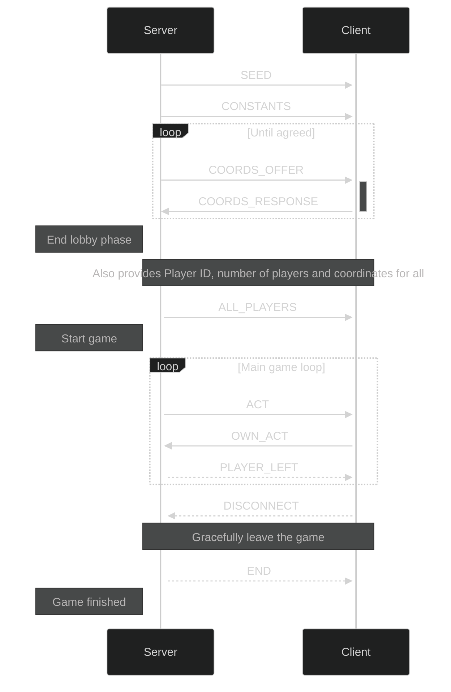

# Main game

- [x] the field goes wearing out with time passing
- [x] when you kill a worm with an headshot, the rest of the body becomes bullets that you can harvest
- [x] the worms leave clay around
- [x] you need to eat meat not to starve
- [x] archers move through the wall breaches...
- [x] ...while worms turn randomly
- [x] mines get triggered by an archer stepping on it...
- [x] ...but for a worm it's sufficient for the head to pass nearby
- [x] loss condition: an enemy reaching top (TUNNEL_UNIT * 2)^2 square
- [x] enemies dieing leave resources in the form of chests that replace them
- [x] provide an option to drop the inventory in a chest on death

# Multiplayer architecture

It will be a client-server architecture over TCP.

## Handshake, flow

_A sequence diagram of the communication between client and server_

- consider that a client disconnect could just be a `Q` sent by the player

- the client will just set the constants from the server

## TCP sockets

- https://stackoverflow.com/a/13021852/15888601

# Saving/sending game state

We need serialization, I was thinking of looking into [cereal](https://uscilab.github.io/cereal/quickstart.html).
